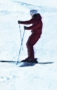

# DB SKI TRAINING OUTLINE

**Intermediate Level (The Austrian System):** 

**Prerequisite:** The client should be able to ski down the advanced slope smoothly and maintain parallel skis in most cases.

## Training Objectives:

- 🎯 Parallel Turning (60%)
- 🎯 Dynamic Parallel Turning (25%)
- 🎯 Pole Plant Technique (10%)
- 🎯 Carving Long Turns (5%, if time permits)

## 1. Quick Review of Previous Skills/Techniques:

-  Intro
-  Snowplough Turns
-  Snowplough Steering

   **Components:**
   - Edging (Traversing)
   - Side Slipping

## 2. Essential Concepts:

- **Middle Position (Central Position):**
  - Explanation:
    - Hip-width stance
    - Slightly bent ankles, knees, and hips
    - Poles and arms positioned as if reading a newspaper
  - Questions:
    - ❓ How to recognize the correct middle position, especially on the slopes?
    - ❓ Clarification of Forward vs. Central concepts;  Have you ever wondered why instructors always emphasize moving your Center of Mass (COM) forward?

- **Alpine Basic Position (Keystone to Alpine Skiing):**
  - Combines middle position with:
  - Advance your uphill ski, hip, arm, and shoulder open to the valley (lean your upper body slightly forward-downard)
      - ❓ what is the gain from this motion?
      - ❓ check points?

- **Stance: Narrow, Neutral, or Wide:**
  - ❓ Clarifying the concept of stance and its variation based on terrain and style (e.g., carving vs. powder skiing).

- **Forward and Inward Motion:**

**Check Points:**
- 👣 Shin contact
- 🔄 Alignment of joint axes (shoulder, hip, knee, ankle)

## 3. Putting Concepts into Practice:

### 3.1 Parallel Turns (Long Radius):
   🎯 Simultaneously changing edges and turning skis. 
   
   ⛷️ **Steps:**
    

        
   

   - Start in basic alpine position on a traverse.
   - Simultaneously move upward, forward, and inward.
   - "__Drift into the fall line__." 
   - Change edges and build pressure with a __downward motion__.
   - Traverse again.

### 3.2 Pole Planting:
   🎯 Improve timing of pole planting.
   
   ⛷️ **Steps:**
   

        
   

   - Use wrist and elbow joints for pole planting.
   - Timing: During edge transition, from flat skis to edging.
   
   ❓ What is the purpose of Pole Planting Explained

### 3.3 Parallel Turns (Short Radius):

  🎯 Achieve rhythmical leg swinging under the upper body to control speed.
   
  ⛷️ **Steps:**

  

        
  

   - Change edges through an upward motion of both legs.
   - Set the pole and turn the ski tips into the new turn.
   - __leg rotation__. 
   
   ❓ Is skiing small turns solely about reducing the radius, or are there other technical movement points to consider? 

### 3.4 Parallel Turns Dynamic (Long Radius):

  🎯 Dynamic
   
  ⛷️ **Steps:**

  

        
  

   - __Early edge__
   - Actively turn the skis with your feet
   - Build up pressure with downward motion and push lower leg forward and inward
   
   ❓ What's the difference between long turn and long turn dynamic?

### 3.5 Parallel Turns Dynamic (Short Radius):

  🎯 Dynamic
   
  ⛷️ **Steps:**

  

        
  

   - Provide pressure on the skis through a down motion, while you keep steering your skis (leg rotation) to complete the turn.
   - Speed, body tension, and flex from the skis create a rebound effect helping to release while changing the edges.
   - Build up pressure with downward motion and push lower leg forward and inward using the edges.
   - Reduce the vertical movement of the body
   
   ❓ What's the difference between short turn and short turn dynamic?

## 4. Common Mistakes:

- 🚫 Back seat skiing
  

        
  

- 🌳 Banking (leaning like a tree)
  

        
  

- 🔄 Rotation
  

        
  

- ↩️ Counter-rotation
  

        
  

- ❌ X-legs
  

        
  
