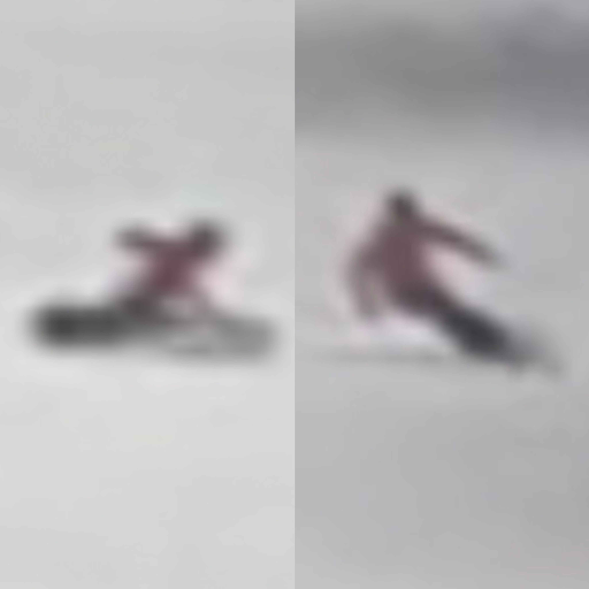

# DB SKI OUTLINE

## Preface ##    

Welcome to an exciting ski lesson! Whether you're a beginner or looking to improve your skills, we're here to guide you through the snow. Our experienced instructors will focus on safety, technique, and the joy of skiing. Let's gear up and hit the slopes for an unforgettable adventure!

## DB Basic Level

The "DB Ski Basic Level Outline" is a comprehensive guide to ski training at the basic level, following the Austrian skiing system. This program is designed for individuals with little to no skiing experience but who have an interest in learning. The training objectives include mastering various skiing techniques, safety awareness, and equipment setup. The outline is divided into several sections:

 

Table of Contents

- [Preface](01_basic.md)
  - [Basic Level (The Austrian System)](01_basic.md#1-intro)
  - [Prerequisite](01_basic.md#prerequisite)
- [Training Objectives](01_basic.md#training-objectives)
- [1. Intro](01_basic.md#1-intro)
- [2. Basic Concepts](01_basic.md#2-basic-concepts)
  - [Safety Awareness](01_basic.md#safety-awareness)
  - [Equipments Set](01_basic.md#equipments-set)
  - [Middle Position (Central Position)](01_basic.md#middle-position-central-position)
  - [Outside Ski vs. Downhill Ski](01_basic.md#outside-ski-vs-downhill-ski)
- [3. Putting Concepts into Practice](01_basic.md#3-putting-concepts-into-practice)
  - [3.1 Schussing](01_basic.md#31-schussing)
  - [3.1 Snowplough (wedge position)](01_basic.md#31-snowplough-wedge-position)
  - [3.2 Snowplough Turns](01_basic.md#32-snowplough-turns)
  - [3.3 Using Lifts](01_basic.md#33-using-lifts)
  - [3.4 Edging -- Traversing](01_basic.md#34-edging----traversing)
  - [3.5 Sliding](01_basic.md#35-sliding)
  - [3.6 Snowplough Steering](01_basic.md#36-snowplough-steering)
  - [3.7 Parallel Turning](01_basic.md#37-parallel-turning)
- [4. Common Mistakes](01_basic.md#4-common-mistakes)

## DB Intermediate Level

The "DB Intermediate Level Outline" presents an intermediate-level ski training program within the Austrian System. Targeting individuals comfortable skiing down advanced slopes with parallel skis, the program aims to refine their skills and introduce advanced techniques.

[Intermediate Level Training Outline]

# Table of Contents

- [Preface](./02_intermediate.md)
  - [Intermediate Level (The Austrian System)](./02_intermediate.md#intermediate-level-the-austrian-system)
  - [Prerequisite](./02_intermediate.md#prerequisite)
- [Training Objectives](./02_intermediate.md#training-objectives)
- [1. Quick Review of Previous Skills/Techniques](./02_intermediate.md#1-quick-review-of-previous-skills-techniques)
- [2. Essential Concepts](./02_intermediate.md#2-essential-concepts)
  - [Middle Position (Central Position)](./02_intermediate.md#middle-position-central-position)
  - [Alpine Basic Position (Keystone to Alpine Skiing)](./02_intermediate.md#alpine-basic-position-keystone-to-alpine-skiing)
  - [Stance: Narrow, Neutral, or Wide](./02_intermediate.md#stance-narrow-neutral-or-wide)
  - [Forward and Inward Motion](./02_intermediate.md#forward-and-inward-motion)
- [3. Putting Concepts into Practice](./02_intermediate.md#3-putting-concepts-into-practice)
  - [3.1 Parallel Turns (Long Radius)](./02_intermediate.md#31-parallel-turns-long-radius)
  - [3.2 Pole Planting](./02_intermediate.md#32-pole-planting)
  - [3.3 Parallel Turns (Short Radius)](./02_intermediate.md#33-parallel-turns-short-radius)
- [4. Common Mistakes](./02_intermediate.md#4-common-mistakes)

## Instructors:

- Jian 
  

        
  

  